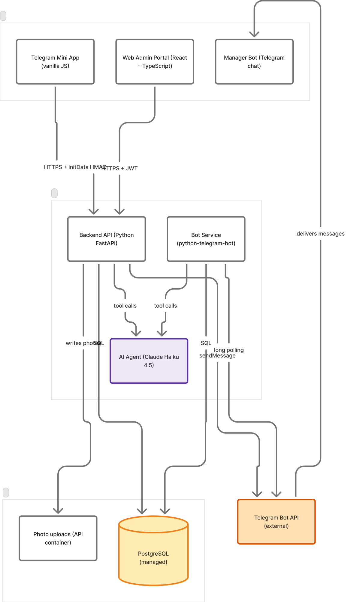
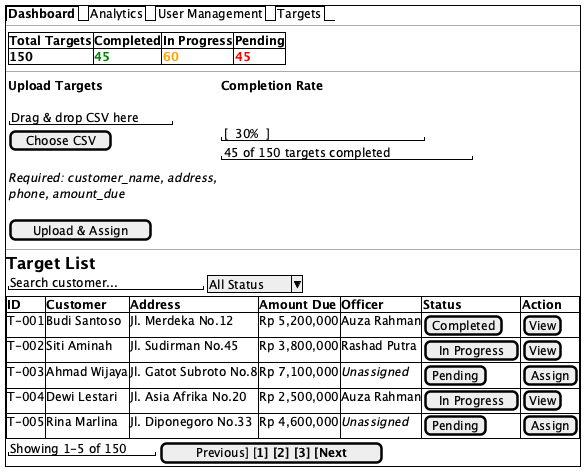
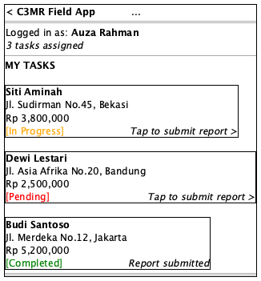
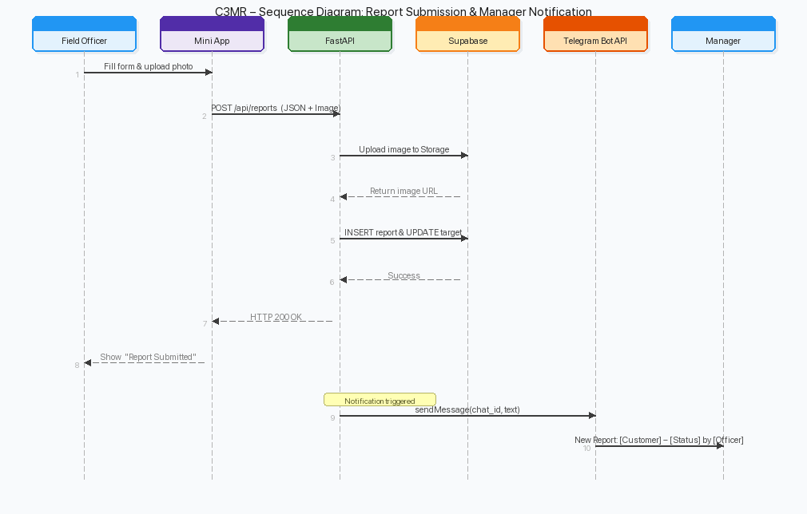
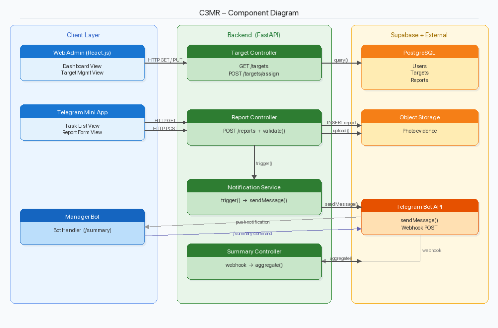

# Form 3 – Design

**Title:** C3MR – Collection Case & Customer Management Report

---

## GROUP MEMBER

| No. | Student Name | Student ID |
|-----|-------------|------------|
| 1.  | …. (Leader) |            |
| 2.  | …. (Member 1) |          |
| 3.  | …. (Member 2) |          |

**Advisor:** ……………………….

---

Submitted for **Capstone Design Project**
to **Faculty of Computer Science**
**President University**

---

## TABLE OF CONTENT

- [Statement of Originality](#statement-of-originality)
- [Screenshot of ZeroGPT](#screenshot-of-zerogpt)
- [Part 3 – Design](#part-3--design)
  - [A. System Design](#a-system-design)
  - [B. Hierarchical / Iterative Design](#b-hierarchical--iterative-design)
  - [C. Standards Used](#c-standards-used)
  - [D. Implementation and Testing Scenario](#d-implementation-and-testing-scenario)
- [References](#references)

---

## STATEMENT OF ORIGINALITY

In my capacity as an active student at President University and as the author of the Capstone Design Project stated below:

- **Name:**
  1. Student Name – NIM
  2. Student Name – NIM
  3. Student Name – NIM
- **Faculty:** Computer Science

I hereby declare that my Capstone Design Project entitled **"C3MR – Collection Case & Customer Management Report"** is to the best of my knowledge and belief, an original piece of work based on sound academic principles. If there is any plagiarism detected in this final project, I am willing to be personally responsible for the consequences of these acts of plagiarism and will accept the sanctions against these acts in accordance with the rules and policies of President University.

I also declare that this work, either in whole or in part, has not been submitted to another university to obtain a degree.

Cikarang, January 2024

| Signer 1 | Signer 2 | Signer 3 |
|-----------|-----------|-----------|
| Student Name – NIM | Student Name – NIM | Student Name – NIM |

---

## SCREENSHOT OF ZEROGPT

*(Insert ZeroGPT plagiarism check screenshot here)*

---

# PART 3 – DESIGN

Consists of:
- A. System Design
- B. Hierarchical / Iterative Design
- C. Standards Used
- D. Implementation and Testing Scenario

---

## A. SYSTEM DESIGN

### Overview

C3MR (Collection Case & Customer Management Report) is a web-based field collection management system designed to streamline the workflow between field officers and managers in the debt collection process. The system follows a **three-tier architecture** consisting of a Presentation Layer, Business Logic Layer, and Data Storage Layer.

### System Architecture

The system architecture is illustrated in the diagram below:



The architecture consists of the following tiers:

**1. Client Tier (Presentation Layer)**
- **Web Admin Portal (React.js):** A browser-based dashboard used by managers to upload collection targets (CSV), assign officers, and monitor progress in real time. It communicates with the backend via HTTPS REST API calls.
- **Telegram Mini App (Web App SDK):** A lightweight mobile interface embedded within Telegram, used by field officers to view assigned tasks, fill visit reports, upload photo evidence, and submit results. It uses the Telegram Web App SDK for native integration.
- **Manager Bot (Telegram Chat):** A Telegram bot that allows managers to receive notifications and issue commands (e.g., reassign targets, view summaries) directly from the Telegram chat interface.

**2. Internet Gateway**
- **HTTPS / WSS Gateway (Cloudflare/Nginx):** Acts as a reverse proxy and load balancer. All client-to-server traffic passes through this gateway, which handles SSL termination, rate limiting, and request routing.

**3. Application Tier (Business Logic)**
- **Backend API Server (Python FastAPI):** The core server-side component responsible for handling all API requests, validating input data (via Pydantic), executing business logic (task assignment, report processing, status updates), and communicating with the database. FastAPI was chosen for its high performance, automatic OpenAPI documentation, and native async support.

**4. Data Tier (Storage Layer)**
- **Relational Database (Supabase PostgreSQL):** Stores all structured data including user accounts, collection targets, visit reports, officer assignments, and audit logs. Supabase provides built-in authentication, Row-Level Security (RLS), and real-time subscriptions.
- **Object Storage (Supabase Storage):** Stores unstructured data such as uploaded photo evidence from field visits. Files are referenced by URL in the relational database.

### Mock-up Designs

#### Web Admin Portal Mock-up



The Web Admin Portal provides the following interface elements:
- **Navigation Tabs:** Dashboard, Targets, Officers, Settings – allowing managers to switch between major sections.
- **Upload Targets Section:** A CSV file upload area with "Choose CSV" and "Upload & Assign" buttons for bulk importing collection targets.
- **System Summary:** Displays aggregate statistics across four cards: Total Targets, Completed (green), In Progress (yellow), and Pending (red).
- **Target List Table:** A sortable/filterable table showing Target ID, Customer name, Address, Amount Due, assigned Officer, Status (Completed / In Progress / Pending), and an Actions column (View or Assign).

#### Telegram Mini App Mock-up



The Telegram Mini App provides the following interface elements:
- **Header:** App name "C3MR Field App" with back navigation.
- **Task Detail:** Displays the current task with customer name, address, phone number, and amount due (highlighted in red).
- **Payment Status Dropdown:** Selectable options: "Promise to Pay", "Paid", "Refused", "Not Home", "Partial Payment".
- **Notes Field:** A scrollable text area for the officer to enter visit notes.
- **Upload Photo Evidence Button:** Triggers the device camera or gallery to capture/select photo proof.
- **Submit Report Button:** Sends the completed report to the backend API.

---

## B. HIERARCHICAL / ITERATIVE DESIGN

### 1. Data Flow Diagram

#### Level 0 – Context Diagram

```
+-----------------+         +-------------------+         +-------------------+
|  Field Officer  | ------> |                   | <------ |     Manager       |
| (Telegram Mini  |  Submit |      C3MR         |  Upload | (Web Admin Portal |
|     App)        |  Report |      System       |  CSV /  |  / Manager Bot)   |
|                 | <------ |                   | ------> |                   |
|                 |  Task   |                   |  Reports|                   |
|                 |  List   |                   |  & Stats|                   |
+-----------------+         +-------------------+         +-------------------+
                                    |     ^
                                    v     |
                            +-------------------+
                            |  Supabase         |
                            |  (PostgreSQL +    |
                            |   Storage)        |
                            +-------------------+
```

#### Level 1 – Major Processes

```
+------------------+       +------------------+       +------------------+
| 1.0              |       | 2.0              |       | 3.0              |
| Authentication   |       | Target           |       | Report           |
| & Authorization  |       | Management       |       | Management       |
+------------------+       +------------------+       +------------------+
        |                          |                          |
        v                          v                          v
+------------------+       +------------------+       +------------------+
| 4.0              |       | 5.0              |       | 6.0              |
| Officer          |       | Dashboard &      |       | Notification     |
| Management       |       | Analytics        |       | Service          |
+------------------+       +------------------+       +------------------+
```

- **1.0 Authentication & Authorization:** Handles user login (Supabase Auth for admin, Telegram user validation for officers), session management, and role-based access control.
- **2.0 Target Management:** Manages CSV upload, parsing, validation, and assignment of collection targets to field officers.
- **3.0 Report Management:** Processes field visit reports including form data validation, photo upload to object storage, and database insertion.
- **4.0 Officer Management:** CRUD operations for field officer records, including linking Telegram user IDs.
- **5.0 Dashboard & Analytics:** Aggregates data for the admin dashboard: total targets, completion rates, officer performance.
- **6.0 Notification Service:** Sends task assignment notifications and status updates via the Telegram Bot API.

#### Level 2 – Report Submission Process (Detailed)

```
Field Officer                Mini App (UI)              FastAPI Backend           Supabase DB
     |                            |                           |                       |
     |-- Fill form & photo ------>|                           |                       |
     |                            |-- POST /api/reports ----->|                       |
     |                            |   (JSON + Image)          |                       |
     |                            |                           |-- Upload image ------->|
     |                            |                           |<-- Return image URL ---|
     |                            |                           |-- INSERT report ------>|
     |                            |                           |   & UPDATE target      |
     |                            |                           |<-- Success ------------|
     |                            |<-- HTTP 200 OK -----------|                       |
     |<-- Show "Success" ---------|                           |                       |
```

### 2. Interface Information Between Components

**Client ↔ Gateway:**
- Protocol: HTTPS (TLS 1.3)
- Data format: JSON (request/response body)
- Authentication: Bearer token in `Authorization` header

**Gateway ↔ Backend API:**
- Protocol: HTTP (internal network)
- Data format: JSON
- Headers forwarded: `Authorization`, `X-Forwarded-For`, `Content-Type`

**Backend API ↔ Database:**
- Protocol: PostgreSQL wire protocol (TCP)
- Interface: Supabase Python client (`supabase-py`)
- Method: Parameterized SQL queries via Supabase client SDK
- Data passing: Function parameter passing (Python dictionaries → SQL parameters)

**Backend API ↔ Object Storage:**
- Protocol: HTTPS
- Interface: Supabase Storage API
- Method: Multipart file upload
- Returns: Public URL string for stored object

**Backend API ↔ Telegram Bot API:**
- Protocol: HTTPS
- Interface: Telegram Bot API (REST)
- Method: HTTP POST with JSON body
- Data passing: Message passing (sendMessage, sendPhoto endpoints)

### 3. Software Engineering Design Steps

The project follows an **Agile (Iterative) development methodology** with the following phases:

1. **Requirements Gathering:** Identify stakeholder needs (managers, field officers), define user stories, and prioritize features in a product backlog.
2. **System Design:** Create architecture diagrams, define API contracts (OpenAPI spec), design database schema, and produce UI mock-ups.
3. **Sprint-based Implementation:** Develop features incrementally in 2-week sprints, starting with core functionality (authentication, target upload, report submission).
4. **Testing:** Unit tests (pytest for backend), integration tests (API endpoint testing), and user acceptance testing (UAT) with stakeholders.
5. **Deployment:** Deploy backend to cloud server, configure Supabase project, register Telegram bot, and publish Mini App.
6. **Review & Iteration:** Collect feedback, fix bugs, and iterate on features.

### 4. Component References and Libraries

**Frontend – Web Admin Portal:**
- React.js (v18.x) – UI framework
- React Router (v6.x) – Client-side routing
- Axios – HTTP client for API calls
- Tailwind CSS – Utility-first CSS framework
- Papa Parse – CSV parsing library
- Chart.js / Recharts – Dashboard chart rendering

**Frontend – Telegram Mini App:**
- Telegram Web App SDK – Native Telegram integration
- HTML5 / CSS3 / JavaScript – Core web technologies
- Fetch API – HTTP client for API calls

**Backend:**
- Python (v3.11+) – Programming language
- FastAPI (v0.100+) – Web framework
- Pydantic (v2.x) – Data validation and serialization
- supabase-py – Supabase Python client SDK
- python-telegram-bot – Telegram Bot API wrapper
- Uvicorn – ASGI server
- python-multipart – File upload handling

**Database & Storage:**
- Supabase – Backend-as-a-Service platform
- PostgreSQL (v15) – Relational database
- Supabase Storage – S3-compatible object storage
- Supabase Auth – Authentication service

**DevOps & Tools:**
- Git / GitHub – Version control
- PlantUML – UML diagram generation
- Postman – API testing

### 5. UML Diagrams

#### Use Case Diagram

```
+-------------------------------------------------------+
|                    C3MR System                         |
|                                                       |
|  +------------------+       +---------------------+   |
|  | Upload CSV       |       | View Dashboard      |   |
|  +------------------+       +---------------------+   |
|         |                          |                  |
|         v                          v                  |
|  +------------------+       +---------------------+   |
|  | Assign Targets   |       | View Reports        |   |
|  +------------------+       +---------------------+   |
|         ^                          ^                  |
|         |                          |                  |
+---------|--------------------------|------------------+
          |                          |
     +---------+                +---------+
     | Manager |                | Manager |
     +---------+                +---------+

+-------------------------------------------------------+
|                    C3MR System                         |
|                                                       |
|  +------------------+       +---------------------+   |
|  | View Task List   |       | Submit Report       |   |
|  +------------------+       +---------------------+   |
|         |                          |                  |
|         v                          v                  |
|  +------------------+       +---------------------+   |
|  | View Task Detail |       | Upload Photo        |   |
|  +------------------+       +---------------------+   |
|         ^                          ^                  |
|         |                          |                  |
+---------|--------------------------|------------------+
          |                          |
   +--------------+          +--------------+
   |Field Officer |          |Field Officer |
   +--------------+          +--------------+
```

**Actors:**
- **Manager:** Uploads CSV targets, assigns officers, views dashboard and reports.
- **Field Officer:** Views assigned task list, views task details, submits visit reports with photo evidence.

#### Class Diagram

```
+---------------------------+       +---------------------------+
|        User               |       |        Target             |
+---------------------------+       +---------------------------+
| - id: UUID                |       | - id: UUID                |
| - telegram_id: String     |       | - customer_name: String   |
| - name: String            |       | - address: String         |
| - role: Enum(manager,     |       | - phone: String           |
|         officer)          |       | - amount_due: Decimal     |
| - created_at: Timestamp   |       | - assigned_officer: UUID  |
+---------------------------+       | - status: Enum(pending,   |
| + authenticate()          |       |   in_progress, completed) |
| + get_profile()           |       | - created_at: Timestamp   |
+---------------------------+       +---------------------------+
         |                          | + assign_officer()        |
         | 1                        | + update_status()         |
         |                          +---------------------------+
         | assigned to                       |
         |                                   | 1
         v *                                 |
+---------------------------+                | has
|        Report             |                |
+---------------------------+                v *
| - id: UUID                |       +---------------------------+
| - target_id: UUID (FK)    |       |      UploadBatch          |
| - officer_id: UUID (FK)   |       +---------------------------+
| - payment_status: Enum    |       | - id: UUID                |
| - notes: Text             |       | - uploaded_by: UUID (FK)  |
| - photo_url: String       |       | - file_name: String       |
| - submitted_at: Timestamp |       | - total_rows: Integer     |
+---------------------------+       | - created_at: Timestamp   |
| + validate()              |       +---------------------------+
| + submit()                |       | + parse_csv()             |
+---------------------------+       | + create_targets()        |
                                    +---------------------------+
```

#### Activity Diagram – Report Submission Flow

```
[Start]
   |
   v
(Officer opens Mini App)
   |
   v
<Authenticated?> --No--> (Redirect to Telegram login) --> <Authenticated?>
   |
  Yes
   |
   v
(Display assigned task list)
   |
   v
(Officer selects a task)
   |
   v
(Display report form)
   |
   v
(Officer fills payment status, notes)
   |
   v
(Officer uploads photo evidence)
   |
   v
(Officer taps "Submit Report")
   |
   v
<Form valid?> --No--> (Show validation errors) --> (Display report form)
   |
  Yes
   |
   v
(Send POST /api/reports to backend)
   |
   v
(Backend uploads photo to Supabase Storage)
   |
   v
(Backend inserts report & updates target status)
   |
   v
<Success?> --No--> (Show error message) --> (Display report form)
   |
  Yes
   |
   v
(Show success confirmation)
   |
   v
(Return to task list)
   |
   v
[End]
```

#### Sequence Diagram – Report Submission



The sequence diagram above illustrates the following steps:
1. Field Officer fills the report form and attaches a photo.
2. Mini App sends a POST request to `/api/reports` with JSON data and the image file.
3. FastAPI backend uploads the image to Supabase Storage.
4. Supabase returns the stored image URL.
5. FastAPI inserts the report data and updates the target status in the database.
6. Supabase confirms success.
7. FastAPI returns HTTP 200 OK to the Mini App.
8. Mini App displays a "Success" message to the Field Officer.

#### Entity Relationship Diagram

```
+-------------+       +-------------+       +-------------+
|   users     |       |   targets   |       |   reports   |
+-------------+       +-------------+       +-------------+
| PK id       |<--+   | PK id       |<---+  | PK id       |
| telegram_id |   |   | customer_   |    |  | FK target_id|----> targets.id
| name        |   |   |   name      |    |  | FK officer_ |----> users.id
| role        |   +---| FK assigned_|    +--|   id        |
| created_at  |       |   officer   |       | payment_    |
+-------------+       | address     |       |   status    |
      |               | phone       |       | notes       |
      |               | amount_due  |       | photo_url   |
      |               | status      |       | submitted_  |
      |               | created_at  |       |   at        |
      |               +-------------+       +-------------+
      |                     ^
      |                     |
      |               +-------------+
      +-------------->| upload_     |
                      |   batches   |
                      +-------------+
                      | PK id       |
                      | FK uploaded_|----> users.id
                      |   by        |
                      | file_name   |
                      | total_rows  |
                      | created_at  |
                      +-------------+
```

**Relationships:**
- A **User** (officer) can be assigned to many **Targets** (1:N).
- A **Target** can have many **Reports** (1:N) – e.g., multiple visit attempts.
- A **Report** belongs to one **Target** and one **User** (officer).
- An **UploadBatch** is created by one **User** (manager) and generates many **Targets**.

#### Component Diagram



The component diagram shows the internal interaction between software components:
- **TaskList_View** and **ReportForm_View** are React/Telegram SDK client components.
- **Report_Controller** is the FastAPI route handler that receives HTTP requests.
- **Pydantic_Validator** validates incoming JSON data against defined schemas.
- **DB_Client** executes parameterized queries against the Supabase PostgreSQL database.

---

## C. STANDARDS USED

| Category | Standard / Technology | Description |
|----------|----------------------|-------------|
| Data Format | JSON (RFC 8259) | All API request and response bodies use JSON format for structured data exchange. |
| API Architecture | REST (RESTful API) | The backend API follows REST conventions with resource-based URLs, standard HTTP methods (GET, POST, PUT, DELETE), and appropriate status codes. |
| API Documentation | OpenAPI 3.0 | FastAPI auto-generates OpenAPI 3.0 specification for all endpoints, enabling interactive Swagger UI documentation. |
| Data Validation | Pydantic v2 | All incoming request data is validated using Pydantic models with strict type checking and custom validators. |
| Authentication | JWT (RFC 7519) | JSON Web Tokens are used for stateless authentication. Supabase Auth issues JWTs upon login. |
| Encryption | TLS 1.3 (RFC 8446) | All client-server communication is encrypted via HTTPS using TLS 1.3. |
| Database | SQL (PostgreSQL 15) | Standard SQL with PostgreSQL extensions for database queries and schema definition. |
| Modeling | UML 2.5 | Unified Modeling Language version 2.5 is used for all design diagrams (use case, class, sequence, activity, component, ERD). |
| Diagram Tool | PlantUML | All UML diagrams are authored in PlantUML markup and rendered to PNG. |
| Code Formatter | Black (Python) | Python code is formatted using Black with default settings (line length 88). |
| Code Formatter | Prettier (JS/TS) | Frontend JavaScript/TypeScript code is formatted using Prettier. |
| Linter | Ruff (Python) | Python code is linted using Ruff for fast, comprehensive style and error checking. |
| Linter | ESLint (JS/TS) | Frontend code is linted using ESLint with recommended rules. |
| CSS Framework | Tailwind CSS v3 | Utility-first CSS framework for consistent, responsive styling. |
| Version Control | Git | Source code is managed using Git with GitHub as the remote repository host. |
| File Upload | Multipart/form-data (RFC 7578) | Photo evidence uploads use multipart/form-data encoding. |
| CSV Format | RFC 4180 | Target data CSV files conform to RFC 4180 for consistent parsing. |
| Bot API | Telegram Bot API v7 | Communication with Telegram uses the official Bot API for message handling and Mini App integration. |
| Character Encoding | UTF-8 | All text data uses UTF-8 encoding throughout the system. |
| Date/Time Format | ISO 8601 | All timestamps follow ISO 8601 format (e.g., `2024-01-15T10:30:00Z`). |

---

## D. IMPLEMENTATION AND TESTING SCENARIO

### Implementation Overview

The system is implemented in an iterative manner across the following phases:

**Phase 1 – Backend Foundation**
- Set up the FastAPI project structure with Uvicorn as the ASGI server.
- Configure Supabase project (PostgreSQL database, Storage buckets, Auth).
- Define database schema and create tables (users, targets, reports, upload_batches).
- Implement authentication middleware using Supabase JWT verification.
- Implement core API endpoints: user registration, target CRUD, report submission.

**Phase 2 – Web Admin Portal**
- Set up React.js project with Tailwind CSS.
- Implement login page with Supabase Auth integration.
- Build dashboard page with summary statistics and charts.
- Build target management page with CSV upload and officer assignment.
- Build report viewing page with filtering and search.

**Phase 3 – Telegram Mini App & Bot**
- Register Telegram bot via BotFather and configure webhook.
- Implement Mini App using Telegram Web App SDK.
- Build task list view and report submission form.
- Implement photo capture and upload functionality.
- Implement Manager Bot commands for notifications and quick actions.

**Phase 4 – Integration & Testing**
- End-to-end integration testing across all components.
- User Acceptance Testing (UAT) with stakeholders.
- Performance testing and optimization.
- Bug fixes and final adjustments.

### Testing Scenarios

#### Scenario 1: Manager Login (Web Admin Portal)

| Step | Action | Expected Result | Alternative |
|------|--------|----------------|-------------|
| 1 | Manager navigates to the Web Admin Portal URL. | Login page is displayed with email and password fields. | If server is unreachable, show "Unable to connect" error. |
| 2 | Manager enters valid email and password, clicks "Login". | System authenticates via Supabase Auth, redirects to Dashboard. JWT token is stored in local storage. | If credentials are invalid, show "Invalid email or password" error message. User remains on login page. |
| 3 | Manager enters email but leaves password empty, clicks "Login". | Client-side validation shows "Password is required" error. No API call is made. | – |
| 4 | Manager's JWT token expires during a session. | System detects 401 response, redirects to login page with "Session expired" message. | – |

#### Scenario 2: Upload CSV Targets (Web Admin Portal)

| Step | Action | Expected Result | Alternative |
|------|--------|----------------|-------------|
| 1 | Manager clicks "Choose CSV" button on the Targets page. | File picker dialog opens, filtered to .csv files. | – |
| 2 | Manager selects a valid CSV file with correct columns (customer_name, address, phone, amount_due). | File name is displayed. Preview of first 5 rows is shown. | If CSV has missing/incorrect columns, show "Invalid CSV format. Required columns: customer_name, address, phone, amount_due" error. |
| 3 | Manager clicks "Upload & Assign". | System parses CSV, creates target records in the database, and creates an upload_batch record. Success message: "150 targets uploaded successfully." | If any row has invalid data (e.g., non-numeric amount), show "Row X: Invalid amount_due value" error. Upload is rejected entirely. |
| 4 | Manager uploads a CSV with 0 data rows (header only). | Show "CSV file contains no data rows" error. Upload is rejected. | – |
| 5 | Manager uploads a non-CSV file (e.g., .xlsx). | Client-side validation rejects file: "Only .csv files are accepted." | – |

#### Scenario 3: Assign Targets to Officers (Web Admin Portal)

| Step | Action | Expected Result | Alternative |
|------|--------|----------------|-------------|
| 1 | Manager selects one or more unassigned targets from the target list. | Selected targets are highlighted. "Assign" button becomes active. | – |
| 2 | Manager clicks "Assign" and selects an officer from the dropdown. | Selected targets are assigned to the officer. Status changes to "In Progress". Notification is sent to officer via Telegram Bot. | If officer has reached max assignment limit, show "Officer has reached maximum assignment capacity" warning. |
| 3 | Manager attempts to reassign an already-assigned target. | Confirmation dialog: "This target is already assigned to [Officer Name]. Reassign to [New Officer]?" On confirm, reassignment proceeds. | If manager cancels, no changes are made. |

#### Scenario 4: Field Officer Views Task List (Telegram Mini App)

| Step | Action | Expected Result | Alternative |
|------|--------|----------------|-------------|
| 1 | Field Officer opens the Mini App from Telegram. | System validates Telegram user ID. Task list is displayed showing all assigned targets with customer name, address, and status. | If Telegram ID is not registered, show "You are not registered as a field officer. Contact your manager." |
| 2 | Task list loads with assigned targets. | Each task shows customer name, address snippet, amount due, and status badge (Pending / In Progress / Completed). Tasks are sorted by status (Pending first). | If no tasks are assigned, show "No tasks assigned. Check back later." |
| 3 | Officer taps on a task. | Task detail view opens with full customer information (name, address, phone, amount due). | – |

#### Scenario 5: Field Officer Submits Report (Telegram Mini App)

| Step | Action | Expected Result | Alternative |
|------|--------|----------------|-------------|
| 1 | Officer opens a task detail and taps "Submit Report". | Report form is displayed with Payment Status dropdown, Notes text area, and "Upload Photo Evidence" button. | – |
| 2 | Officer selects a payment status from the dropdown (e.g., "Promise to Pay", "Paid", "Refused", "Not Home", or "Partial Payment"). | Selection is recorded. Dropdown shows the selected value. | – |
| 3 | Officer types notes in the text area (e.g., "Customer will pay by Friday"). | Text is recorded in the notes field. | – |
| 4 | Officer taps "Upload Photo Evidence". | Device camera or gallery opens. Officer can take a photo or select an existing image. | If camera/gallery permission is denied, show "Please grant camera access to upload photos." |
| 5 | Officer captures/selects a photo. | Photo thumbnail preview is displayed in the form. | If photo exceeds 10MB, show "Photo size exceeds 10MB limit. Please take a smaller photo." |
| 6 | Officer taps "Submit Report" with all fields filled. | POST request is sent to `/api/reports`. Photo is uploaded to Supabase Storage. Report record is inserted. Target status is updated to "Completed". Success message: "Report submitted successfully." Officer is returned to task list. | If network error occurs, show "Failed to submit report. Please check your connection and try again." Report data is preserved in form. |
| 7 | Officer taps "Submit Report" without selecting a payment status. | Validation error: "Please select a payment status." Form is not submitted. | – |
| 8 | Officer taps "Submit Report" without uploading a photo. | Validation error: "Please upload photo evidence." Form is not submitted. | – |

#### Scenario 6: Manager Views Dashboard (Web Admin Portal)

| Step | Action | Expected Result | Alternative |
|------|--------|----------------|-------------|
| 1 | Manager navigates to the Dashboard page. | Dashboard loads with summary cards (Total Targets, Completed, Pending, In Progress) and charts (completion rate over time, officer performance). | If no data exists, show "No data available yet. Upload targets to get started." |
| 2 | Manager views the Target List table. | Table displays all targets with columns: ID, Customer, Address, Amount Due, Officer, Status, and Actions. Table supports sorting by any column and filtering by status. | – |
| 3 | Manager clicks on a completed target row. | Target detail view opens showing customer information and the submitted report (payment status, notes, photo evidence). | – |

#### Scenario 7: Manager Bot Notifications (Telegram)

| Step | Action | Expected Result | Alternative |
|------|--------|----------------|-------------|
| 1 | A field officer submits a report. | Manager receives a Telegram notification: "📋 New Report: [Customer Name] – [Payment Status] by [Officer Name]." | If bot is blocked by manager, notification fails silently. Log error for admin review. |
| 2 | Manager sends `/summary` command to the bot. | Bot responds with a text summary: total targets, completed count, pending count, and completion percentage. | If no targets exist, bot responds "No targets found." |

---

## REFERENCES

*(Add references in APA/IEEE format)*

1. FastAPI Documentation. (n.d.). Retrieved from https://fastapi.tiangolo.com/
2. Supabase Documentation. (n.d.). Retrieved from https://supabase.com/docs
3. Telegram Bot API Documentation. (n.d.). Retrieved from https://core.telegram.org/bots/api
4. Telegram Mini Apps Documentation. (n.d.). Retrieved from https://core.telegram.org/bots/webapps
5. React.js Documentation. (n.d.). Retrieved from https://react.dev/
6. PlantUML Documentation. (n.d.). Retrieved from https://plantuml.com/
7. Pydantic Documentation. (n.d.). Retrieved from https://docs.pydantic.dev/
8. RFC 8259 – The JavaScript Object Notation (JSON) Data Interchange Format. (2017). Retrieved from https://datatracker.ietf.org/doc/html/rfc8259
9. RFC 7519 – JSON Web Token (JWT). (2015). Retrieved from https://datatracker.ietf.org/doc/html/rfc7519
